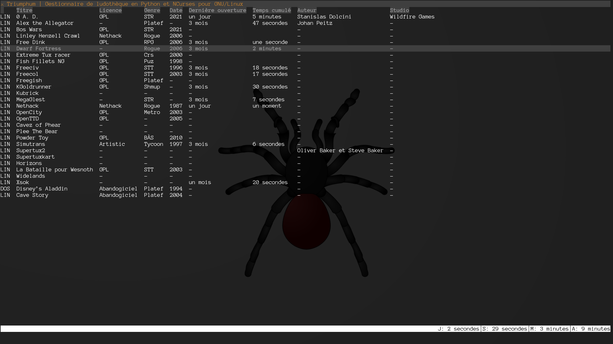
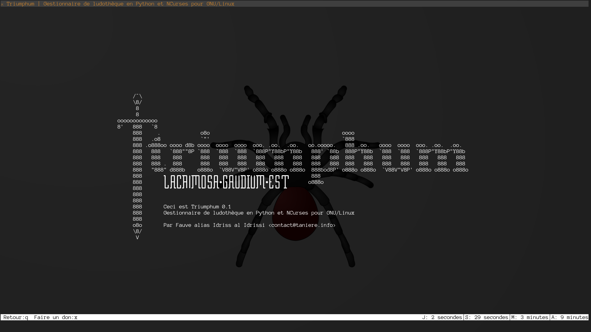

# Triumphum

# Description

Triumphum est un gestionnaire de ludothèque. Il permet aux joueurs de gérer leur collection de jeux mais aussi d’organiser et de suivre leur activité ludique. Il permet notement de suivre le temps consacré à chaque jeu et la temporalité.

# Fonds d’écrans
## Liste des jeux

## Écran à propos

# Prochaines fonctionnalités
- [ ] Gestion de la locale
- [ ] Graphique du temps et des dates de jeu
- [ ] Mode de recherche
- [ ] Prise de commentaire
- [ ] Consomation moyenne de RAM|GPU par jeu
- [ ] Poid des jeux

