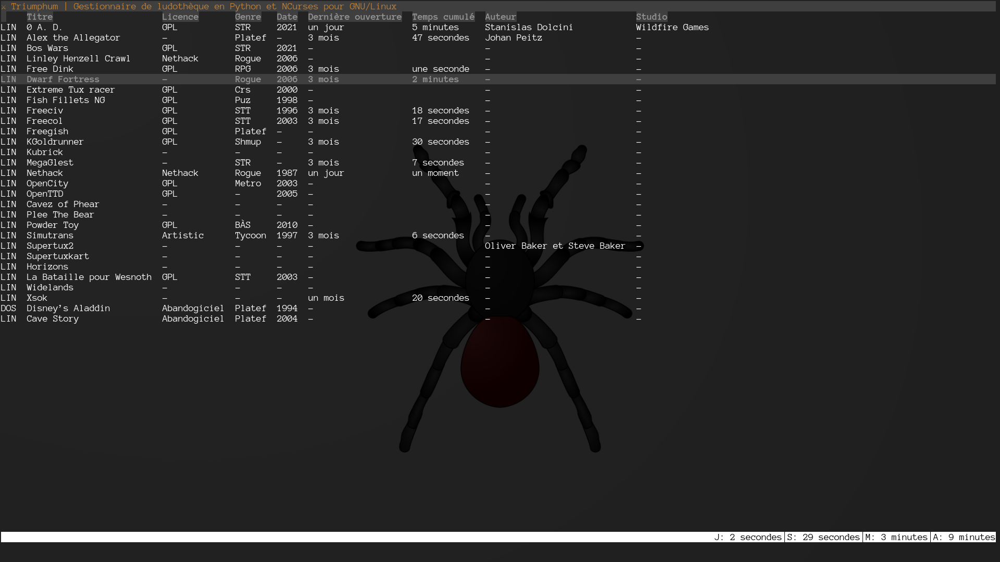
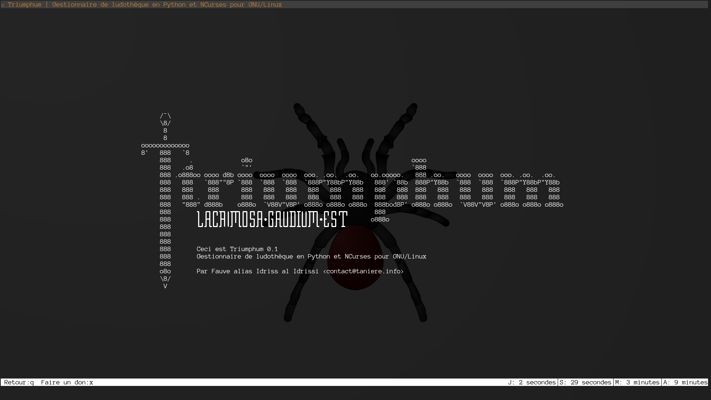

<h1>Triumphum</h1>
			<h2><a href="#nom">NOM</a></h2>
			

            
			

			<h2><a href="#devise">DEVISE</a></h2>
			
LACRIMOSA·GAVDIVM·EST

			<h2><a href="#synopsis">SYNOPSIS</a></h2>
			<code><b class="constant">triumphum</b> [-h | -a | -d]</code>

<code><b class="constant">triumphum</b> [--config-file <var>FICHIER_CONF</var>] [--games <var>FICHIER_JEUX</var>] [--platforms <var>FICHIER_PLATEFORMES</var>] [--licences <var>FICHIER_LICENCES</var>] [--genres <var>FICHIERS_GENRES</var>] [-v]
          [--tui] [--no-splash] [--layout <var>LAYOUT</var>]</code>

<code><b class="constant">triumphum</b> [--config-file <var>FICHIER_CONF</var>] [--games <var>FICHIER_JEUX</var>] [--platforms <var>FICHIER_PLATEFORMES</var>] [--licences <var>FICHIER_LICENCES</var>] [--genres <var>FICHIERS_GENRES</var>] [-v]
          -r <var>JEU</var></code>

<code><b class="constant">triumphum</b> [--config-file <var>FICHIER_CONF</var>] [--games <var>FICHIER_JEUX</var>] [--platforms <var>FICHIER_PLATEFORMES</var>] [--licences <var>FICHIER_LICENCES</var>] [--genres <var>FICHIERS_GENRES</var>] [-v]
          [--add-game <var>DESCRIPTEUR_JEU</var> | --add-licence <var>DESCRIPTEUR_LICENCE</var> | --add-genre <var>DESCRIPTEUR_GENRE</var> | --add-platform <var>DESCRIPTEUR_PLATEFORME</var> | --del-game <var>JEU</var> | --del-licence <var>LICENCE</var> | --del-genre <var>GENRE</var> | --del-platform <var>PLATEFORME</var>]</code>

<code><b class="constant">triumphum</b> [--config-file <var>FICHIER_CONF</var>] [--games <var>FICHIER_JEUX</var>] [--platforms <var>FICHIER_PLATEFORMES</var>] [--licences <var>FICHIER_LICENCES</var>] [--genres <var>FICHIERS_GENRES</var>] [-v]
          [--list-games | --list-licences | --list-genres | --list-platforms]</code>

<code><b class="constant">triumphum</b> [--config-file <var>FICHIER_CONF</var>] [--games <var>FICHIER_JEUX</var>] [--platforms <var>FICHIER_PLATEFORMES</var>] [--licences <var>FICHIER_LICENCES</var>] [--genres <var>FICHIERS_GENRES</var>] [-v]
          [--ag | --al | --at | --ap]</code>
			<h2><a href="#description">DESCRIPTION</a></h2>
			

			Triumphum est un gestionnaire de collection de jeux pour GNU/Linux. Il permet d’avoir une liste des jeux disponibles (ou ayant été à un moment donné disponible), de les lancer, et aussi d’avoir un suivi du temps qui y a été consacré. 
			Lorsqu’il est ouvert avec l’option <b><a href="#option--tui" class="option">--tui</a></b> qui est le comportement par défaut, Triumphum présente l’interface en TUI où l’utilisateur peut interagir interactivement.
			

			<h2><a href="#terminologie">TERMINOLOGIE</a></h2>
			

			Dans la suite, sera utilisé le terme « genre » pour désigner ce qui ailleurs est appelé « type » de jeu (stratégie, temps réel, tour par tour, etc). « Genre » a été préféré à « type » dans la nomenclature de Triumphum car ce dernier a été jugé trop ambigüe.
			

			<h2><a href="#options">OPTIONS</a></h2>
			<h3><a href="#options-aide">Aide</a></h3>
			<dl>
				<dt><a href="#option--help">-h, --help</a></dt>
				<dd>Montre une aide succincte sur la ligne de commande</dd>
				<dt><a href="#option--about">-a, --about</a></dt>
				<dd>Présente rapidement les informations sur la commande et son auteur</dd>
				<dt><a href="#option--donate">-d, --donate</a></dt>
				<dd>Ouvrir le lien de don sur le navigateur.</dd>
			</dl>
			<h3><a href="#comportement-interface">Comportement de l’interface</a></h3>
			<dl>
				<dt><a href="#option--tui" class="option">--tui</a></dt>
				<dd>Ouvre l’interface interactive en TUI. Ceci est le comportement par défaut.</dd>
				<dt><a href="#option--run">-r <var>JEU</var>, --run <var>JEU</var></a></dt>
				<dd>Lancer le jeu de code <var>JEU</var> en traquant le temps qui y est consacré par Triumphum.</dd>
			</dl>
			<h3><a href="#options-generales">Options générales</a></h3>
			<dl>
				<dt><a href="#option--verbose">-v, --verbose</a></dt>
				<dd>Mode verbeux. Donne des informations sur les configurations en cours.</dd>
				<dt><a href="#option--no-splash">--no-splash</a></dt>
				<dd>N’imprime pas la bannière en art ASCII sur la sortie standard. Comportement par défaut.</dd>
				<dt><a href="#option--list-games">--list-games</a></dt>
				<dd>Afficher la liste détaillée des jeux.</dd>
				<dt><a href="#option--list-licences">--list-licences</a></dt>
				<dd>Afficher la liste détaillée des licences.</dd>
				<dt><a href="#option--list-genres">--list-genres</a></dt>
				<dd>Afficher la liste détaillée des genres de jeu.</dd>
				<dt><a href="#option--list-platforms">--list-platforms</a></dt>
				<dd>Afficher la liste détaillée des genres des plateformes.</dd>
			</dl>
			<h3><a href="#options-configuration">Options de configuration</a></h3>
			<dl>
				<dt><a href="#option--config-file">-c <var>FICHIER_CONF</var>, --config-file <var>FICHIER_CONF</var></a></dt>
				<dd>Utiliser comme fichier de configuration générale <var>FICHIER_CONF</var>, au lieux de celui par défaut. Voir la section  <b><a class="ref-to-h3" href="#triumphumrc">triumphumrc</a></b>. </dd>
				<dt><a href="#option--games">-g <var>FICHIER_JEUX</var>, --games <var>FICHIER_JEUX</var></a></dt>
				<dd>Utiliser comme fichier de description des jeux <var>FICHIER_JEUX</var>, au lieux de celui par défaut. Voir la section  <b><a class="ref-to-h3" href="#games.json">games.json</a></b>.</dd>
				<dt><a href="#option--platforms">-p <var>FICHIER_PLATEFORMES</var>, --platforms <var>FICHIER_PLATEFORMES</var></a></dt>
				<dd>Utiliser comme fichier de description des jeux <var>FICHIER_PLATEFORMES</var>, au lieux de celui par défaut. Voir la section  <b><a class="ref-to-h3" href="#listOfPlatforms.json">listOfPlatforms.json</a></b>.</dd>
				<dt><a href="#option--licences">-l <var>FICHIER_LICENCES</var>, --licences <var>FICHIER_LICENCES</var></a></dt>
				<dd>Utiliser comme fichier de description des licence <var>FICHIER_LICENCES</var>, au lieux de celui par défaut. Voir la section  <b><a class="ref-to-h3" href="#listOfLicences.json">listOfLicences.json</a></b>.</dd>
				<dt><a href="#option--genres">-t <var>FICHIER_GENRES</var>, --genres <var>FICHIER_GENRES</var></a></dt>
				<dd>Utiliser comme fichier de description des genres <var>FICHIER_GENRES</var>, au lieux de celui par défaut. Voir la section  <b><a class="ref-to-h3" href="#listOfGenres.json">listOfGenres.json</a></b></dd>
				<dt><a href="#option--layout">--layout <var>DISPOSITION</var></a></dt>
				<dd>Utiliser des raccourcis dactyliques adaptés à la disposition de clavier <var>DISPOSITION</var>. Valeurs possibles : bepo, azerty, qwerty. Voir la section <b><a class="ref-to-h2" href="#attribution-des-touches">ATTRIBUTION DES TOUCHES</a></b> affin de modifier les associations par défaut.</dd>
			</dl>
			<h3><a href="#ajoutDonee">Ajout de donnée</a></h3>
			<dl>
				<dt><a href="#option--add-game">--add-game <var>DESCRIPTEUR_JEU</var></a></dt>
				<dd>Ajouter un nouveau jeu. Voir la section <b><a class="ref-to-h3" class="ref-to-h3" href="#descripteurs-jeux">Descripteurs des jeux</a></b>.</dd>
				<dt><a href="#option--add-licence">--add-licence <var>LICENCE</var></a></dt>
				<dd>Ajouter une nouvelle licence. Voir la section <b><a class="ref-to-h3" href="#descripteurs-licence">Descripteurs des licences</a></b>.</dd>
				<dt><a href="#option--add-genre">--add-genre <var>GENRE</var></a></dt>
				<dd>Ajouter un nouveau genre de jeu. Voir la section <b><a class="ref-to-h3" href="#descripteurs-genres">Descripteurs des genres</a></b>.</dd>
				<dt><a href="#option--add-platform">--add-platform <var>PLATFORM</var></a></dt>
				<dd>Ajouter une nouvelle plateforme. Voir la section <b><a class="ref-to-h3" href="#descripteurs-plateformes">Descripteurs des plateforme</a></b>.</dd>
			</dl>
			<h3><a href="#suppression-donnee">Suppression de donnée</a></h3>
			<dl>
				<dt><a href="#option--del-game">--del-game <var>JEU</var></a></dt>
				<dd>Supprimer un jeu.</dd>
				<dt><a href="#option--del-licence">--del-licence <var>LICENCE</var></a></dt>
				<dd>Supprimer une licence.</dd>
				<dt><a href="#option--del-genre">--del-genre <var>GENRE</var></a></dt>
				<dd>Supprimer un genre de jeu.</dd>
				<dt><a href="#option--del-platform">--del-platform <var>PLATEFORME</var></a></dt>
				<dd>Supprimer une plateforme.</dd>
			</dl>
			<h3><a href="#commandes-auto-completion">Commandes utiles à l’auto-complétion</a></h3>
			<dl>
				<dt><a href="#option--ag">--ag</a></dt>
				<dd>Lister les codes des jeux.</dd>
				<dt><a href="#option--al">--al</a></dt>
				<dd>Lister les codes des licences.</dd>
				<dt><a href="#option--at">--at</a></dt>
				<dd>Lister les codes des genres de jeu.</dd>
				<dt><a href="#option--ap">--ap</a></dt>
				<dd>Lister les codes des plateformes.</dd>
			</dl>
			<h2><a href="#exemples-utiles">EXEMPLES UTILES</a></h2>
			<dl>
				<dt><b class="constant">triumphum</b> --run <var>JEU</var></dt>
				<dd>Lancer le jeu <var>JEU</var> depuis le shell tout en traquant le temps de jeu par Triumphum</dd>
				<dt><b class="constant">triumphum</b> --layout bepo</dt>
				<dd>Ouvrir l’interface TUI de Triumphum avec des associations de touches adaptées à la disposition BÉPO.</dd>
			</dl>
			<h2><a href="#interface-tui">INTERFACE TUI</a></h2>
			

			À l’ouverture, l’interface se présente sous la forme de quatre zones principales.
			

			

			<pre>┏━━━━━━━━━━━━━━━━━━━━━━━━━━━━━━━━━━━━━━━━━━━━━━━━━━━━━━━━━━━━━━━━┓
┃Barre de titre                                                  ┃
┡━━━━━━━━━━━━━━━━━━━━━━━━━━━━━━━━━━━━━━━━━━━━━━━━━━━━━━━━━━━━━━━━┩
│                                                                │
│                                                                │
│                                                                │
│                         Lite des jeux                          │
│                                                                │
│                                                                │
│                                                                │
│                                                                │
┢━━━━━━━━━━━━━━━━━━━━━━━━━━━━━━━━━━━━━━━━━━━━━━━━━━━━━━━━━━━━━━━━┪
┃Statu                                              Récapitulatif┃
┡━━━━━━━━━━━━━━━━━━━━━━━━━━━━━━━━━━━━━━━━━━━━━━━━━━━━━━━━━━━━━━━━┩
│Zone de saisie de commande                                      │
└────────────────────────────────────────────────────────────────┘</pre>
			

			<dl>
				<dt>Barre de titre</dt>
				<dd>Elle ne sert à rien sinon pour faire joli et présenter le nom du logiciel.</dd>
				<dt>Liste des jeux</dt>
				<dd>La liste des jeux à proprement parler qui est interactive.</dd>
				<dt>Barre de statu</dt>
				<dd>
					Elle même divisée en deux parties. À gauche sont présentées les messages affichés par Triumphum, et à droite un récapitulatif du temps cumulé de jeu de tous les jeux conofondus, sous la forme
					

						J: <var>&lt;jour&gt;</var>│S: <var>&lt;semaine&gt;</var>│M: <var>&lt;mois&gt;</var>│A: <var>&lt;année&gt;</var>
					

					Où les valeurs associées à J, S, M, et A, correspondent respectivement au temps de jeu cumulé écoulé durant le jour, la semaine, le mois, et l’année.
				</dd>
				<dt>Zone de saisie de commande</dt>
				<dd>Lieu où s’affiche les commandes du shell interne saisies par l’utilisateur.</dd>
			</dl>
			

			Au sein de l’interface TUI, il est possible d’interagir avec au travers des différentes actions qui s’actionnent par les touches dédiées dans la section <b><a class="ref-to-h2" href="#bindings">BINDINGS</a></b>.
			

			<h2><a href="#bindings">BINDINGS</a></h2>
			<dl>
				<dt> t</dt>
				<dd>Aller vers l’élément au dessous</dd>
				<dt> s</dt>
				<dd>Aller vers l’élément au dessus</dd>
				<dt> Enter</dt>
				<dd>Lancer le jeu ayant le focus</dd>
				<dt> e</dt>
				<dd>Éditer le jeu ayant le focus (expérimental)</dd>
				<dt> a</dt>
				<dd>Ouvrir le lien associé au jeu ayant le focus</dd>
				<dt> y</dt>
				<dd>Copier le lien associé au jeu dans le presse-papier</dd>
				<dt> c</dt>
				<dd>Ajouter un commentaire au jeu (expérimental)</dd>
				<dt> b</dt>
				<dd>Trier la liste des jeux par ordre alphabétique des titres</dd>
				<dt> é</dt>
				<dd>Trier la liste des jeux par permissivité des licences</dd>
				<dt> p</dt>
				<dd>Trier la liste des jeux par ordre alphabétique des genres</dd>
				<dt> o</dt>
				<dd>Trier la liste des jeux par date de sortie</dd>
				<dt> è</dt>
				<dd>Trier la liste des jeux par date de dernière ouverture</dd>
				<dt> v</dt>
				<dd>Trier la liste des jeux par durée de jeu cumulée</dd>
				<dt> P</dt>
				<dd>Trier la liste des jeux par ordre alphabétique des noms de plateformes</dd>
				<dt> L</dt>
				<dd>Rafraichir la liste</dd>
				<dt> l</dt>
				<dd>Montrer la licence du jeu ayant le focus</dd>
				<dt> x</dt>
				<dd>Faire un don (ouvre le lien de don dans le navigateur)</dd>
				<dt> q</dt>
				<dd>Quitter le jeu</dd>
				<dt> /</dt>
				<dd>Filtrer selon le motif (expérimental)</dd>
				<dt> h</dt>
				<dd>Afficher l’aide</dd>
			</dl>
			<h2><a href="#descripteurs">DESCRIPTEURS</a></h2>
			

			Les descripteurs des objets (jeux, licences, plateformes, genre), permettent d’ajouter de nouveaux objets à ceux gérés par Triumphum. Ils se présentent simplement sous la forme d’une suite de clés-valeurs, où les clés, dépendent de chaque type, et où certaines sont obligatoires pour certains types d’objets.
			

			<h3><a href="#descripteurs-jeux">Descripteurs des jeux</a></h3>
			<dl>
				<dt>name</dt>
				<dd>Nom littéral du jeu. (Obligatoire)</dd>
				<dt>code</dt>
				<dd>Code à travers lequel le jeu sera traité et identifié par Triumphum. (Obligatoire)</dd>
				<dt>command</dt>
				<dd>Commande d’exécution du jeu. (Obligatoire)</dd>
				<dt>genre</dt>
				<dd>code du genre attribué au jeu.</dd>
				<dt>licence</dt>
				<dd>Code de la licence attribuée au jeu.</dd>
				<dt>url</dt>
				<dd>Lien du jeu.</dd>
				<dt>studios</dt>
				<dd>Noms du ou des studios ayant développé le jeu. Plusieurs studios ont leur noms séparés par une virgule.</dd>
				<dt>authors</dt>
				<dd>Noms du ou des auteurs ayant développé le jeu. Plusieurs auteurs ont leur noms séparés par une virgule.</dd>
				<dt>shortDesc</dt>
				<dd>Courte description du jeu.</dd>
				<dt>year</dt>
				<dd>Année de sortie du jeu.</dd>
				<dt>Exemple</dt>
				<dd><code>name="0 A. D." code=0ad command=0ad-pyrogenesis genre=rts licence=gpl url=https://play0ad.com studios="Wildfire Games" authors=Stanislas\ Dolcini shortdesc="RTS libre historique en 3D où s’affrontent diverses civilisations antiques." year=2010</code></dd>
			</dl>
			<h3><a href="#descripteurs-licences">Descripteurs des licences</a></h3>
			<dl>
				<dt>name</dt>
				<dd>Nom littéral de la licence. (Obligatoire)</dd>
				<dt>code (Obligatoire)</dt>
				<dd>Code à travers lequel la licence sera traitée et identifié par Triumphum. (Obligatoire)</dd>
				<dt>abbr</dt>
				<dd>Abréviation sous laquelle apparaitra le nom de la licence dans les situations qui l’exigent.</dd>
				<dt>url</dt>
				<dd>Lien de la licence.</dd>
				<dt>freedomCoefficient</dt>
				<dd>Coefficient de liberté de la licence de 0 à 1, où 1 représente la licence la plus permissive (par exemple domaine public ou LPRAB) et 0 la licence la moins permissive.</dd>
				<dt>shortDesc</dt>
				<dd>Courte description de la licence.</dd>
				<dt>Exemple</dt>
				<dd>name="Licence Art Libre" code=lal abbr=LAL url=https://artlibre.org freedomCoefficient=0.5 shortDesc="La licence LAL (Licence Art Libre) permet la libre utilisation, modification et redistribution des œuvres, tant que la même liberté est préservée dans les œuvres dérivées."</dd>
			</dl>
			<h3><a href="#descripteurs-plateformes">Descripteurs des plateformes</a></h3>
			<dl>
				<dt>name</dt>
				<dd>Nom littéral de la plateforme. (Obligatoire)</dd>
				<dt>code</dt>
				<dd>Code à travers lequel la plateforme sera traitée et identifiée par Triumphum. (Obligatoire)</dd>
				<dt>abbr</dt>
				<dd>Abréviation sous laquelle apparaitra le nom de la plateforme dans les situations qui l’exigent.</dd>
				<dt>Exemple</dt>
				<dd>name=Linux code=linux abbr=LIN</dd>
			</dl>
			<h3><a href="#descripteurs-genres">Descripteurs des genres</a></h3>
			<dl>
				<dt>name</dt>
				<dd>Nom littéral du genre. (Obligatoire)</dd>
				<dt>code</dt>
				<dd>Code à travers lequel le genre sera traité et identifié par Triumphum. (Obligatoire)</dd>
				<dt>abbr</dt>
				<dd>Abréviation sous laquelle apparaitra le nom du genre dans les situations qui l’exigent.</dd>
				<dt>Exemple</dt>
				<dd>name="Jeu de rôle en ligne massivement multijoueur" code=mmorpg abbr=MMORPG</dd>
			</dl>
			<h2><a href="#fichiers-configuration">FICHIERS DE CONFIGURATION</a></h2>
			<h3><a href="#triumphumrc">triumphumrc</a></h3>
			

			Principal fichier de configuration portant essentiellement sur les raccourcis claviers et les éléments graphiques de l’interface TUI.
			

			

			Il est possible d’y configurer essentiellement deux aspects. D’une part les associations de touches, pour cela voir la section <b><a class="ref-to-h2" href="#attribution-des-touches">ATTRIBUTION DES TOUCHES</a></b> ; et d’autre part les éléments graphiques apparaissant sur l’interface, pour cela voir la section <b><a class="ref-to-h2" href="#elements-graphiques">ÉLÉMENTS GRAPHIQUES DE L’INTERFACE.</a></b>
			

			<h3><a href="#games.json">games.json</a></h3>
			

			Fichier de configuration des jeux tels qu’ils apprissent dans la liste principale.
			Il se présente sous la forme d’une liste JSON, où chaque entrée est un dictionnaire JSON représentant un jeu. 
			

			

			Dans chaque dictionnaire les clés sont les mêmes que celles du descripteur dans la section <b><a class="ref-to-h3" href="#descripteurs-jeux">Descripteurs des jeux</a></b>.
			Toute fois, les clés authors et studios sont sensées recevoir des listes en valeurs, même si elles ne doivent contenir qu’une seule valeur.
			

			<dl>
				<dt>Exemple</dt>
				<dd>
					<pre>{
        &quot;games&quot;: [
                {
                        &quot;name&quot;: &quot;0 A. D.&quot;,
                        &quot;licence&quot;: &quot;gpl&quot;,
                        &quot;year&quot;: 2021,
                        &quot;genre&quot;: &quot;rts&quot;,
                        &quot;command&quot;: &quot;0ad&quot;,
                        &quot;code&quot;: &quot;0ad&quot;,
                        &quot;url&quot;: &quot;<a href="https://play0ad.com/">https://play0ad.com/</a>&quot;,
                        &quot;platform&quot;: &quot;linux&quot;,
                        &quot;studios&quot;: [
                                &quot;Wildfire Games&quot;
                        ],
                        &quot;authors&quot;: [
                                &quot;Stanislas Dolcini&quot;
                        ],
                        &quot;shortDesc&quot;: &quot;RTS libre historique en 3D où s’affrontent diverses civilisations antiques.&quot;
                },
                …
        ]
}</pre>
				</dd>
			</dl>
			<h3><a href="#listOfGenres.json">listOfGenres.json</a></h3>
			

			Fichier contenant les définitions des genres reconnus par Triumphum. 
			Il se présente sous la forme d’une liste JSON, où chaque entrée est un dictionnaire JSON représentant un genre. 
			

			

			Dans chaque dictionnaire les clés sont les mêmes que celles du descripteur dans la section <b><a class="ref-to-h3" href="#descripteurs-genres">Descripteurs des genres</a></b>.
			

			<dl>
				<dt>Exemple</dt>
				<dd>
					<pre>{
        &quot;genres&quot;: [
                {
                        &quot;name&quot;: &quot;Action&quot;,
                        &quot;abbr&quot;: &quot;Act&quot;,
                        &quot;code&quot;: &quot;action&quot;
                },
                …
        ]
}</pre>
				</dd>
			</dl>
			<h3><a href="#listOfLicences.json">listOfLicences.json</a></h3>
			

			Fichier contenant les définitions des licence reconnues par Triumphum.
			Il se présente sous la forme d’une liste JSON, où chaque entrée est un dictionnaire JSON représentant une Licence. 
			

			

			Dans chaque dictionnaire les clés sont les mêmes que celles du descripteur dans la section <b><a class="ref-to-h3" href="#descripteurs-licence">Descripteurs des licences</a></b>.
			

			<dl>
				<dt>Exemple</dt>
				<dd>
					<pre>{
        &quot;licences&quot;: [
                {
                        &quot;name&quot;: &quot;GNU General Public License&quot;,
                        &quot;abbr&quot;: &quot;GPL&quot;,
                        &quot;code&quot;: &quot;gpl&quot;,
                        &quot;url&quot;: &quot;<a href="https://www.gnu.org/licenses/gpl-3.0.html">https://www.gnu.org/licenses/gpl-3.0.html</a>&quot;,
                        &quot;shortText&quot;: &quot;La licence publique générale GNU est une licence de logiciel libre adoptée par la Free Software Foundation (FSF) pour le projet GNU.&quot;,
                        &quot;freedomCoefficient&quot;: 0.8
                },
                …
        ]
}</pre>
				</dd>
			</dl>
			<h3><a href="#listOfPlatforms.json">listOfPlatforms.json</a></h3>
			

			Fichier contenant les plateformes des licence reconnues par Triumphum. 
			Il se présente sous la forme d’une liste JSON, où chaque entrée est un dictionnaire JSON représentant une plateforme. 
			

			

			Dans chaque dictionnaire les clés sont les mêmes que celles du descripteur dans la section <b><a class="ref-to-h3" href="#descripteurs-plateformes">Descripteurs des plateformes</a></b>.
			

			<dl>
				<dt>Exemple</dt>
				<dd>
					<pre>{
        &quot;platforms&quot;:
        [
                {
                        &quot;name&quot;: &quot;Linux&quot;,
                        &quot;code&quot;: &quot;linux&quot;,
                        &quot;abbr&quot;: &quot;LIN&quot;
                },
                …
        ]
}</pre>
				</dd>
			</dl>
			<h3><a href="#history.json">history.json</a></h3>
			

			Historique des parties jouées, avec heure de début, de fin, et temps de jeu. 
			Il se présente sous la forme d’une liste JSON où chaque entrée représente un jeu représenté par le code du dit jeu en tant que clé de l’entrée.
			

			

			En suite, à chaque entrée de jeu est associée comme valeur une liste où chaque entrée représente une session de jeu définie par les trois propriétés :
			

			<dl>
				<dt>start_time</dt>
				<dd>Début de la session de jeu au format ISO. Exemple : 2024-04-20T18:36:35.</dd>
				<dt>end_time</dt>
				<dd>Fin de la session de jeu au format ISO. Exemple : 2024-04-20T18:36:40.</dd>
				<dt>duration</dt>
				<dd>Durée totale de la session, au format ISO. Exemple : 0:00:04.959013.</dd>
				<dl>Exemple d’historique pour un jeu</dl>
				<dd>
					<pre>&quot;0ad&quot;: [
        {
                &quot;start_time&quot;: &quot;2024-04-20T17:40:22&quot;,
                &quot;end_time&quot;: &quot;2024-04-20T17:40:27&quot;,
                &quot;duration&quot;: &quot;0:00:04.967317&quot;
        },
        {
                &quot;start_time&quot;: &quot;2024-04-20T18:07:47&quot;,
                &quot;end_time&quot;: &quot;2024-04-20T18:07:51&quot;,
                &quot;duration&quot;: &quot;0:00:03.419640&quot;
        },
        {
                &quot;start_time&quot;: &quot;2024-04-21T16:13:58&quot;,
                &quot;end_time&quot;: &quot;2024-04-21T16:14:02&quot;,
                &quot;duration&quot;: &quot;0:00:03.594571&quot;
        },
        {
                &quot;start_time&quot;: &quot;2024-04-21T17:10:58&quot;,
                &quot;end_time&quot;: &quot;2024-04-21T17:11:02&quot;,
                &quot;duration&quot;: &quot;0:00:03.840515&quot;
        }
]</pre><dd>
			</dl>
			<h2><a href="#attribution-des-touches">ATTRIBUTION DES TOUCHES</a></h2>
			

			Par défaut, le mécanisme général prévoit d’utiliser la carte d’association définie par la disposition choisie avec <b><a class="option" href="#option--layout">--layout</a></b>.
			Toutefois, il es possible de redéfinir de nouvelles associations de touches à travers le fichier <b><a href="#triumphumrc">triumphumrc</a></b> en associant la clé d’une action donnée à la touche voulue, sous la forme :
			

			

				<var>&lt;clé&gt;</var>=<var>&lt;touche&gt;</var>
			

			

			Et ce où <var>&lt;clé&gt;</var> est l’une des valeurs de  <b><a href="#liste-bindings">Liste des bindings de touches</a></b> et où <var><touche></var> répond aux exigences de <b><a href="#codes-touches">Codes des touches</a></b>.
			

			<h3><a href="#liste-bindings">Liste des bindings de touches</a></h3>
			<dl>
				<dt>bind_down</dt>
				<dd>Aller vers l’élément au dessous (Défaut : t)</dd>
				<dt>bind_up</dt>
				<dd>Aller vers l’élément au dessus (Défaut : s)</dd>
				<dt>bind_play</dt>
				<dd>Lancer le jeu ayant le focus (Défaut : Enter)</dd>
				<dt>bind_edit</dt>
				<dd>Éditer le jeu ayant le focus (expérimental) (Défaut : e)</dd>
				<dt>bind_open_link</dt>
				<dd>Ouvrir le lien associé au jeu ayant le focus (Défaut : a)</dd>
				<dt>bind_copy_link</dt>
				<dd>Copier le lien associé au jeu dans le presse-papier (Défaut : y)</dd>
				<dt>bind_comment</dt>
				<dd>Ajouter un commentaire au jeu (expérimental) (Défaut : c)</dd>
				<dt>bind_sort_title</dt>
				<dd>Trier la liste des jeux par ordre alphabétique des titres (Défaut : b)</dd>
				<dt>bind_sort_licence</dt>
				<dd>Trier la liste des jeux par permissivité des licences (Défaut : é)</dd>
				<dt>bind_sort_game_genre</dt>
				<dd>Trier la liste des jeux par ordre alphabétique des genres (Défaut : p)</dd>
				<dt>bind_sort_year</dt>
				<dd>Trier la liste des jeux par date de sortie (Défaut : o)</dd>
				<dt>bind_sort_last_opening</dt>
				<dd>Trier la liste des jeux par date de dernière ouverture (Défaut : è)</dd>
				<dt>bind_sort_playing_duration</dt>
				<dd>Trier la liste des jeux par durée de jeu cumulée (Défaut : v)</dd>
				<dt>bind_sort_playing_platform</dt>
				<dd>Trier la liste des jeux par ordre alphabétique des noms de plateformes (Défaut : P)</dd>
				<dt>bind_refresh</dt>
				<dd>Rafraichir la liste (Défaut : L)</dd>
				<dt>bind_show_licence</dt>
				<dd>Montrer la licence du jeu ayant le focus (Défaut : l)</dd>
				<dt>bind_donate</dt>
				<dd>Faire un don (ouvre le lien de don dans le navigateur) (Défaut : x)</dd>
				<dt>bind_quit</dt>
				<dd>Quitter le jeu (Défaut : q)</dd>
				<dt>bind_filter</dt>
				<dd>Filtrer selon le motif (expérimental) (Défaut : /)</dd>
				<dt>bind_help</dt>
				<dd>Afficher l’aide (Défaut : h)</dd>
			</dl>
			<h3><a href="#codes-touches">Codes des touches</a></h3>
			

			De façon générale, toutes les touches sont représentées par la lettre qui leur est associée. Ainsi le code pour la touche A est A. Toutefois le mécanisme est sensible à la casse.
			

			

			À cela, s’ajoute les cas particuliers suivants
			

			<dl>
				<dt>Enter</dt>
				<dd>Touche entrée</dd>
				<dt>Space</dt>
				<dd>Touche espace</dd>
				<dt>Return</dt>
				<dd>Touche de retour</dd>
			</dl>
			<h2><a href="#elements-graphiques">ÉLÉMENTS GRAPHIQUES DE L’INTERFACE</a></h2>
			

			Dans le  <b><a href="#triumphumrc">triumphumrc</a></b>, il est possible de changer divers symboles apparaissant sur l’interface TUI en associant la clé du dit symbole au nouveau symbole voulu, sous la forme :
			

			

				<var>&lt;clé&gt;</var>=<var>&lt;symbole&gt;</var>
			

			

			Et ce où <var>&lt;clé&gt;</var> est l’une des valeurs ci-dessous
			et où <var>&lt;symbole&gt;</var> est une chaine de caractères.
			

			<h3><a href="#elements-liste">Éléments de la liste</a></h3>
			<dl>
				<dt>general_void_symbol</dt>
				<dd>Symbole par défaut remplaçant toutes les valeurs manquantes de la liste (Défault : -)</dd>
				<dt>name_void_symbol</dt>
				<dd>Symbole remplaçant les noms de jeu manquants sur la liste (Défault : -)</dd>
				<dt>platform_void_symbol</dt>
				<dd>Symbole remplaçant les plateformes manquantes sur la liste (Défault : -)</dd>
				<dt>licence_void_symbol</dt>
				<dd>Symbole remplaçant les licences manquantes sur la liste (Défault : -)</dd>
				<dt>type_void_symbol</dt>
				<dd>Symbole remplaçant les types manquants sur la liste (Défault : -)</dd>
				<dt>date_void_symbol</dt>
				<dd>Symbole remplaçant les dates de sorties manquantes sur la liste (Défault : -)</dd>
				<dt>lastopening_void_symbol</dt>
				<dd>Symbole remplaçant les dates de dernière ouverture manquantes sur la liste (Défault : -)</dd>
				<dt>cumulatedtime_void_symbol</dt>
				<dd>Symbole remplaçant les temps totaux manquants sur la liste (Défault : -)</dd>
				<dt>author_void_symbol</dt>
				<dd>Symbole remplaçant les auteurs manquants sur la liste (Défault : -)</dd>
				<dt>studio_void_symbol</dt>
				<dd>Symbole remplaçant les studios manquants sur la liste (Défault : -)</dd>
			</dl>
			<h3><a href="#elements-recapitulatif">Éléments du récapitulatif</a></h3>
			<dl>
				<dt>cumulated_time_played_per_day</dt>
				<dd>Symbole antécédent au temps de jeu cumulé par jour (Défault : J)</dd>
				<dt>cumulated_time_played_per_week</dt>
				<dd>Symbole antécédent au temps de jeu cumulé par semaine (Défault : S)</dd>
				<dt>cumulated_time_played_per_month</dt>
				<dd>Symbole antécédent au temps de jeu cumulé par mois (Défault : M)</dd>
				<dt>cumulated_time_played_per_year</dt>
				<dd>Symbole antécédent au temps de jeu cumulé par année (Défault : A)</dd>
				<dt>cumulated_time_played_separator</dt>
				<dd>Séparateur entre les temps de jeux cumulés par périodes (Défault : │)</dd>
			</dl>
			<h2><a href="#installation">INSTALLATION</a></h2>
			<h3><a href="#installation-debian">Debian, Ubuntu, et debianides</a></h3>
			

			<pre>curl --location <a class="link" href="https://github.com/FauveNoir/triumphum/raw/main/triumphum.deb">https://github.com/FauveNoir/triumphum/raw/main/triumphum.deb</a> | sudo dpkg --install -
sudo apt-get install --fix-broken --assume-yes
			</pre>
			

			<h2><a href="#extraloquence">EXTRALOQUENCE</a></h2>
			

			Cette section regroupe les propos additionnels ainsi que les réflexions connexes.
			

			<h3><a href="#histoire">Histoire</a></h3>
			<h4><a href="#histoire-2024-07-25">2024-07-25</a></h4>
			

			L’idée originelle de ce logiciel provint de deux courroies. La première fût que j’avais dans mes moments creux besoins d’une réponse à la question « À quoi puis-je jouer en ce moment ? ». Bien entendu, sur la plus part des systèmes GNU/Linux, l’on peut lister le contenu de <var>/usr/games</var>, mais enfin, quiconque l’a inspecté au moins une fois s’est rendu compte qu’il ne répond pas vraiment à cette question. Car d’une part il peut contenir aussi bien des émulateurs, des éditeurs de cartes de jeu, ou tout logiciel ayant trait aux jeux sans être un jeu lui même ; et parce que d’autre part, il ne liste évidement pas des jeux que l’utilisateur aurait configuré sur des émulateurs, voir même des jeux qui ne se jouent qu’à travers le web.
			

			

			La deuxième courroie était le fait que je rencontrais une amie, elle même joueuse invétérée, qui profitait de tous ses congés pour s’adonner aux jeux sortis dans l’année auxquels elle n’avait pas pu consacré du temps. Et il se trouvait qu’elle maintenait un long tableur de bureautique contenant environ cent-trente jeu. Et avec le zèle d’une bonne élève, elle commentait méticuleusement dans une colonne dédiée ce qu’elle avait pensé de chaque jeu. C’est pourquoi il est prévu dans la raison d’être de Triumphum d’intégrer la possibilité de tenir un historique de commentaires qui refléteront l’évolution de l’utilisateur de ses réflexions concernant chaque jeu. Aussi cette fonctionnalité ne saurait tarder à venir dans de prochaines versions.
			

			

			Il s’est alors trouvé que de la conjonction de ces deux facteurs, l’idée de Triumphum s’imposa presque aussitot comme une évidence.
			

			<h4><a href="#histoire-2024-08-13">2024-08-13</a></h4>
			

			Après la première publication de Triumphum, je recontactais cette amie pour lui faire part de la chose. Elle en fut amusée, et répondit :
			

			<blockquote>
				Trop cool ! 
				« un long tableur de bureautique contenant environ cent-trente jeu » 
				Comme c'est mignon 😂 
				Si c'est de moi que tu parles c'est un peu plus 😆
			</blockquote>
			

			Et de me montrer sa liste qui désormais en contenait plus d’un millier.
			

			

			À cela je répondit que non seulement son besoin m’avait inspiré Triumphum, mais qu’avec le nombre de jeu elle avait plus que jamais besoin de cet utilitaire. Ce à quoi elle répondit « Mon tableur fait déjà l’affaire ».
			

			<h3><a href="#fonctionnalite-notation">Fonctionnalité de notation</a></h3>
			

			Bien que dans l’industrie du jeu vidéo et l’univers qui y est associé, il est commun d’attribuer des notes aux jeu, j’ai décidé après mûre réflexion que jamais cette fonctionnalité ne sera intégrée à Triumphum.
			

			

			Le fait est que pareil usage n’a strictement aucune autre utilité que dans le contexte très particulier de l’industrie et plus encore des distributeurs. En d’autres termes, les notes de jeu attribuée par des magasines de connivence avec les éditeurs, n’a d’autre intérêt que de diriger le consommateur en lui disant qu’il doit acheter tel jeu car ayant une note de plus de huit ou neuf sur dix. Or, à priori, un utilisateur de Triumphum n’est pas ce père de famille qui, un 24 décembre à 20 h se demande désespérément quoi acheter comme jeu à ses enfants avant de se poser la même question dix minutes plus tard pour le parfum à acheter à sa femme. Triumphum ne vend rien à ses utilisateur, et n’a pas à reprendre à son compte les obsessions de l’industrie.
			

			<h2><a href="#a-faire">À FAIRE</a></h2>
			<ul>
				<li class="done">Autocompletion pour Zsh ;</li>
				<li class="done">Autocompletion pour Bash ;</li>
				<li class="done">Modularisation des différentes parties ;</li>
				<li class="undone">Paquet .deb ;</li>
				<li class="undone">Commenter le code ;</li>
				<li class="undone">Message d’érreur pour le terminal trop petit ;</li>
				<li class="undone">Gestion de la locale ;</li>
				<li class="undone">Graphique du temps et des dates de jeu ;</li>
				<li class="undone">Mode de recherche ;</li>
				<li class="undone">Prise de commentaire ;</li>
				<li class="undone">Génération de la manpage et du site web à travers xml ;</li>
				<li class="undone">Autocempletion dans le shell interne ;</li>
				<li class="undone">Consomation moyenne de RAM|GPU par jeu ;</li>
				<li class="undone">Poid des jeux ;</li>
				<li class="undone">Filtre ;</li>
				<li class="undone">Affichage de l’aide sur l’interface TUI ;</li>
				<li class="undone">Éditer les jeux sur l’interface TUI.</li>
			</ul>
			<h2><a href="#captures-decran">CAPTURES D’ÉCRAN</a></h2>
			<h3><a href="#liste-des-jeux">Liste des jeux</a></h3>
			

			
			

			<h3><a href="#ecran-a-propos">Écran à propos</a></h3>
			

			
			

			<h2><a href="#voir-aussi">VOIR AUSSI</a></h2>
			<ul class="inline">
				<li><a href="https://lutris.net/">lutris(1)<a>,</li>
				<li><a href="https://wiki.gnome.org/Apps/Games">gnome-games(1)<a>.</li>
			</ul>
			<h2><a href="#liens">LIENS</a></h2>
			<h3><a href="#site-web">Site web</a></h3>
			

			<a class="link" href="https://fauvenoir.github.io/triumphum/">https://fauvenoir.github.io/triumphum/</a>
			

			<h3><a href="#depot">Dépot Git</a></h3>
			

			<a class="link" href="https://github.com/FauveNoir/triumphum/">https://github.com/FauveNoir/triumphum/</a>
			

			<h3><a href="#don">Don</a></h3>
			

			Pour soutenir Triumphum et faire en sorte qu’il continue et s’améliore, merci de faire un don sur
			<a class="link" href="https://paypal.me/ihidev">https://paypal.me/ihidev</a>.
			

			<h2><a href="#auteur">AUTEUR</a></h2>
			

			Écrit par Fauve alias Idriss al Idrissi &lt;<a href="mailto:contact@taniere.info" class="link">contact@taniere.info</a>&gt;.
			

